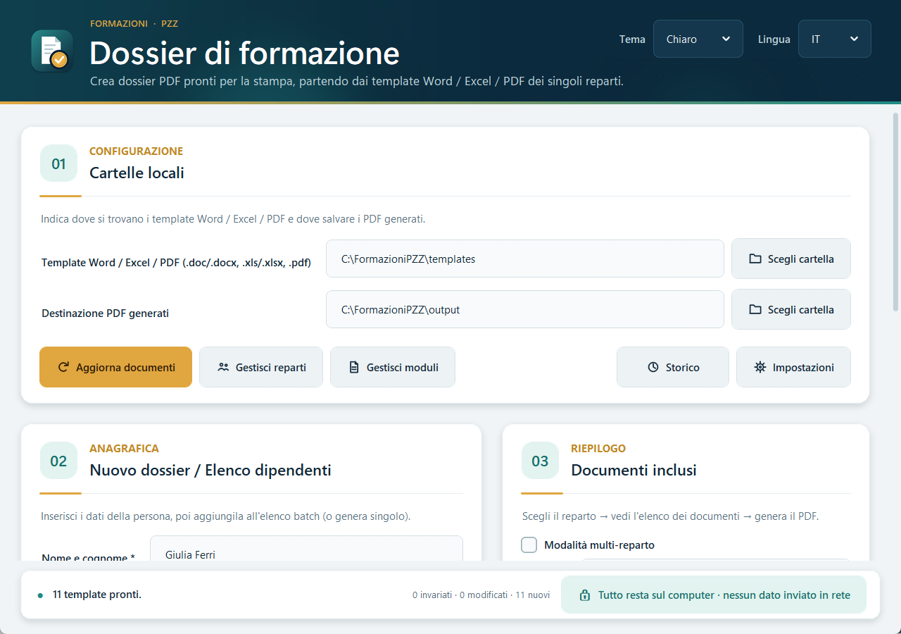
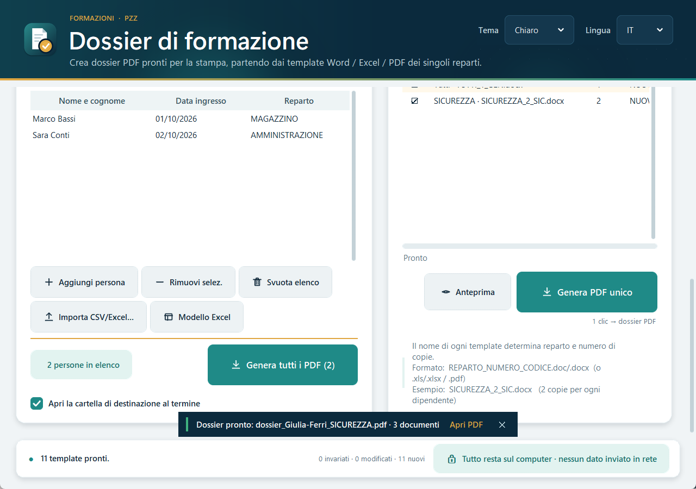
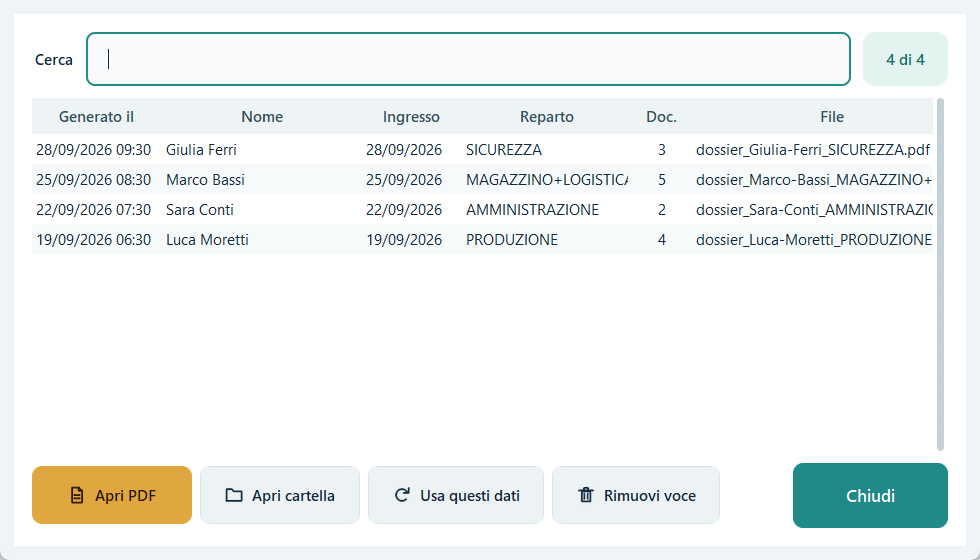
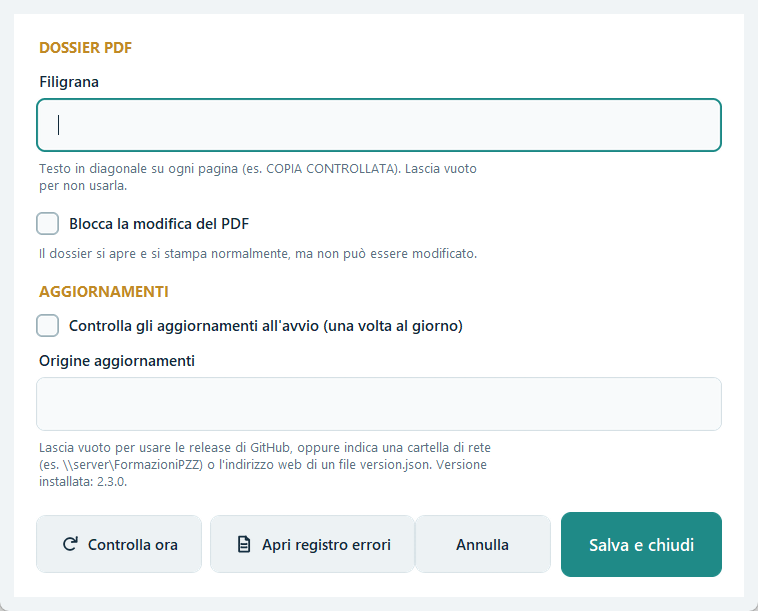
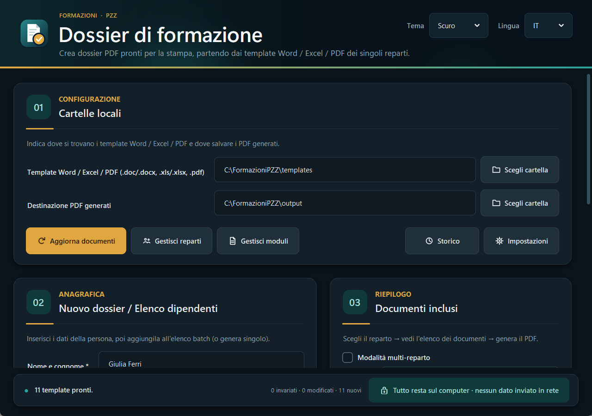

# Formazioni PZZ — Guida all'uso

Formazioni PZZ prepara in pochi secondi il **dossier di formazione in PDF** per chi entra in azienda. Il programma prende i moduli Word, Excel e PDF del reparto, ci scrive nome e data di ingresso della persona e li unisce in un unico file pronto da stampare. Tutto avviene sul computer: nessun dato viene inviato in rete.

## 1. Installazione

1. Apri la pagina [ultima versione](https://github.com/motthz/formazionepzz/releases/latest) e scarica **`FormazioniPZZ_Setup.exe`**.
2. Avvialo. Se Windows mostra "Windows ha protetto il PC", clicca **Ulteriori informazioni → Esegui comunque**: succede con i programmi nuovi non ancora firmati digitalmente.
3. Clicca **Installa**. Non servono permessi di amministratore. Il collegamento compare sul desktop e nel menu Start.

Gli aggiornamenti successivi sono automatici: quando esce una nuova versione compare un avviso con **Aggiorna ora**. Formazioni PZZ si chiude e si riapre aggiornato, senza perdere modelli, reparti e impostazioni.

## 2. Preparare i modelli

I modelli (template) stanno nella cartella `templates` dentro la cartella del programma. Si aggiungono più comodamente da **Gestisci moduli**, oppure trascinando i file sulla finestra.

Il **nome del file** dice al programma a quale reparto appartiene il modulo e quante copie stampare:

| Nome del file | Significato |
|---|---|
| `SICUREZZA_2_SIC.docx` | reparto SICUREZZA, 2 copie |
| `TUTTI_1_GEN.docx` | va nel dossier di **tutti** i reparti, 1 copia |
| `MAGAZZINO_1_MAG.xlsx` | reparto MAGAZZINO, 1 copia (foglio Excel) |

Dentro i modelli scrivi **`*nome*`** e **`*data*`** dove devono comparire nome e data di ingresso: il programma li sostituisce da solo. I moduli senza segnaposto, come regolamenti e procedure, vengono convertiti una volta sola e poi riusati, quindi si generano più in fretta.

## 3. Creare un dossier

1. Nella scheda **02** scrivi nome e cognome e scegli la data di ingresso.
2. Nella scheda **03** scegli il reparto. Con **Modalità multi-reparto** puoi sceglierne più di uno. L'elenco mostra i documenti che entreranno nel dossier: togli la spunta a quelli da escludere.
3. Clicca **Anteprima** per un controllo veloce (una copia per modulo, con la scritta ANTEPRIMA), poi **Genera PDF unico**.

A fine lavoro compare un avviso in basso con **Apri PDF**. Se nel frattempo stavi usando un'altra finestra, arriva anche la notifica di Windows.

## 4. Più persone insieme (batch)

- Dopo aver scritto nome e data, premi **Invio** o **Aggiungi persona**: la persona entra nell'elenco della scheda 02.
- Per molte persone usa **Modello Excel**: scarichi un file già pronto con le colonne Nome, Data e Reparto. Compilalo, poi caricalo con **Importa CSV/Excel** oppure trascinalo sull'elenco.
- **Genera tutti i PDF** crea un dossier per ogni persona, convertendo tutti i moduli in un'unica sessione di Word.

## 5. Storico

**Storico** elenca i dossier generati, con ricerca per nome o reparto. Puoi riaprire il PDF o la cartella, oppure usare **Usa questi dati** per ricompilare il modulo e rigenerare il dossier.

## 6. Impostazioni

- **Filigrana**: testo in diagonale su ogni pagina, per esempio `COPIA CONTROLLATA`.
- **Blocca la modifica del PDF**: il dossier si apre e si stampa, ma non si può modificare.
- **Aggiornamenti**: controllo automatico all'avvio, al massimo una volta al giorno; si può disattivare.
- **Apri registro errori**: il file da allegare se segnali un problema.

## Scorciatoie da tastiera

| Tasti | Azione |
|---|---|
| Ctrl+G | Genera il dossier |
| Ctrl+P | Anteprima |
| Ctrl+B | Genera tutti i PDF dell'elenco |
| Ctrl+H | Storico |
| Ctrl+, | Impostazioni |
| F5 | Aggiorna documenti |
| Invio (nel campo nome) | Aggiungi la persona all'elenco |
| F1 | Elenco delle scorciatoie |

## Tema chiaro, scuro o "Sistema"

In alto a destra scegli il tema. **Sistema** segue le impostazioni di Windows, anche se cambiano mentre il programma è aperto.

## Problemi?

Apri una segnalazione nella pagina [Issues](https://github.com/motthz/formazionepzz/issues/new/choose): il modulo guidato chiede cosa è successo. Allega il **registro errori**, che trovi con il pulsante in Impostazioni, nella cartella `%LOCALAPPDATA%\FormazioniPZZ`.
